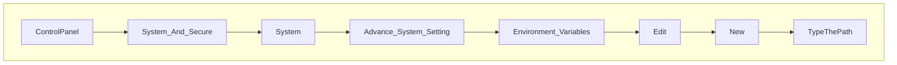
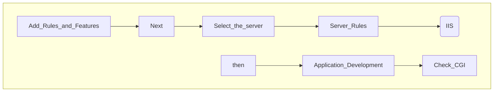

# Prevent Indexes of 
Disable directory browsing as follows:
1. Open the Apche24/conf/httpd.conf
2. Add this code in it.

```
DocumentRoot "${SRVROOT}/htdocs"
<Directory "${SRVROOT}/htdocs/*">
	Options -Indexes +FollowSymLinks
	AllowOverride None
	Require all granted
</Directory>
```
3. Save it.
4. Stop and start Apache2.4
Result:


# Install PHP in Apache for Windows 2019
1. Visit [windows.php.net](https://windows.php.net/)
2. Download [php-7.2.22-Win32-VC15-x64.zip](https://windows.php.net/downloads/releases/archives/php-7.2.22-Win32-VC15-x64.zip)
3. Create a new folder in Drive C:, named `PHP7.2`
4. Upzip the __zip file__ and put all the extracted files in the folder `PHP7.2`
5. Set the __Environment Variable__ for the path `C:\PHP7.2`


6. Open __Windows Command Line__ (`cmd.exe`) and type `php-v` and press `Enter`.
7. Open the file __C:Apache24\conf\httpd__
8. Add this code:
```
#PHP configuration
LoadModule php7_module "c:/php7.2/php7apache2_4.dll"
AddHandler application/x-httpd-php .php
AddType application/x-httpd-php .php .html
PHPIniDir "c:/php7"
```
9. Open `Service`, the program for starts, stops, and configures Windows services. Click __Apache2.4__. Click `stop`, wait, and click `start`.
10. Open `Server Manager` and click `Manage` on the menu.

11. Open cdm.exe, then stop and start Apache24.
12. Open Server Manager. Click Tool, click Internet Information Service(IIS) Manage. Then click ESC-4E59.
13. Double clicks `Handler Mapping`.
14. Click `Add Managed Handler`.
15. Edit Module Mapping:
```
Request Path
*php

Module
FastCgiModule

Excutable
C:\PHP7.2\php-cgi.exe

Name
PHP
```

## How to install SSL Certificates
1. Get the `SSL Certificate` from CA, _e.g._, [ZeroSSL.com](https://app.zerossl.com/signup/free)
>[!NOTE]
>SSL Certificates are 3 files to be installed in Apache's __ssl__ folder:
>- certificate.crt
>- private.key
>- ca_bundle.crt

3. Add the SSL Cert files in the `ssl folder`: C:Apache24/conf/ssl
4. Open the `httpd-ssl` file, at C:/Apache24/conf/extra/httpd-ssl, and insert these codes:
```
SSLCertificateFile "${SRVROOT}/conf/ssl/certificate.crt"
SSLCertificateKeyFile "${SRVROOT}/conf/ssl/private.key"
SSLCertificateChainFile "${SRVROOT}/conf/ssl/ca_bundle.crt"
```
4. Open the `Services` program, stop and start Apache2.4
