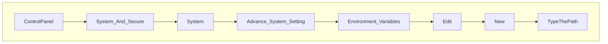
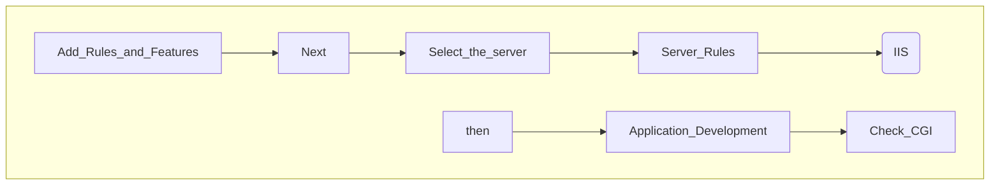

# Prevent Indexes of 
To disable directory browsing,
1. Open `httpd.conf`, at _Apache24/conf/httpd.conf_
2. Add this code in it.

```
DocumentRoot "${SRVROOT}/htdocs"
<Directory "${SRVROOT}/htdocs/*">
	Options -Indexes +FollowSymLinks
	AllowOverride None
	Require all granted
</Directory>
```
3. Save it.
4. Stop and start `Apache2.4`

Result:
>[!WARNING]
>

>[!TIP]
>Always make a copy of httpd.conf as a backup file, or you may destroy and cannot restore the old version.

# Install PHP in Apache for Windows 2019
1. Visit [windows.php.net](https://windows.php.net/)
2. Download [php-7.2.22-Win32-VC15-x64.zip](https://windows.php.net/downloads/releases/archives/php-7.2.22-Win32-VC15-x64.zip)
3. Create a new folder in Drive C:, named `PHP7.2`
4. Upzip the __zip file__ and put all the extracted files in the folder `PHP7.2`
5. Set the __Environment Variable__ for the path `C:\PHP7.2`


6. Open __Windows Command Line__ (`cmd.exe`) and type `php-v` and press `Enter`.
7. Open the file __C:Apache24\conf\httpd__
8. Add this code:
```
#PHP configuration
LoadModule php7_module "c:/php7.2/php7apache2_4.dll"
AddHandler application/x-httpd-php .php
AddType application/x-httpd-php .php .html
PHPIniDir "c:/php7"
```
9. Open `Service`, the program for starts, stops, and configures Windows services. Click __Apache2.4__. Click `stop`, wait, and click `start`.
10. Open `Server Manager` and click `Manage` on the menu.

11. Open cdm.exe, then stop and start Apache24.
12. Open Server Manager. Click Tool, click Internet Information Service(IIS) Manage. Then click ESC-4E59.
13. Double clicks `Handler Mapping`.
14. Click `Add Managed Handler`.
15. Edit Module Mapping:
```
Request Path
*php

Module
FastCgiModule

Excutable
C:\PHP7.2\php-cgi.exe

Name
PHP
```

## Install SSL Certificates
1. Get the `SSL Certificate` from CA, _e.g._, [ZeroSSL.com](https://app.zerossl.com/signup/free)
>[!NOTE]
>SSL Certificates are 3 files to be installed in Apache's __ssl__ folder:
>- certificate.crt
>- private.key
>- ca_bundle.crt

3. Add the SSL Cert files in the `ssl folder`: C:Apache24/conf/ssl
4. Open the `httpd-ssl` file, at _C:/Apache24/conf/extra/httpd-ssl_, and insert this code:
```
SSLCertificateFile "${SRVROOT}/conf/ssl/certificate.crt"
SSLCertificateKeyFile "${SRVROOT}/conf/ssl/private.key"
SSLCertificateChainFile "${SRVROOT}/conf/ssl/ca_bundle.crt"
```
4. Open`Services`, to stop and start Apache2.4

## Set index.html at the defualt website folder /dWeb/
```
<!DOCTYPE html>
<html>
<title>MNRE SLC</title>
<meta name="viewport" content="width=device-width, initial-scale=1">
<link rel="stylesheet" href="https://www.w3schools.com/w3css/4/w3.css">
<body onload="move()";">
<div class="MNRE SLC">
<div style="margin:10px 5% 0% 10px;">
<h2>Connecting to the server</h2>

<div class="w3-light-grey">
  <div id="myBar" class="w3-container w3-green w3-center" style="width:5px;height:10px;"></div>
</div>
<div id="load"></div>
</div>
</div>
<script>
function move() {
  var elem = document.getElementById("myBar");   
  var elem2 = document.getElementById("load");     
  var width = 20;
  var id = setInterval(frame, 50);
  function frame() {
    if (width >= 100) {
      clearInterval(id);
    } else {
      width++; 
      elem.style.width = width + '%'; 
      elem2.innerHTML = "Loading(" + width * 1  + '%)';
	  var load = document.getElementById("load").innerHTML;
	  if(load=="Loading(100%)"){setInterval(loading, 10);}
    }
 
  }
function loading(){
 window.location.replace('https://.....');
}
}
</script>

</body>
</html> 
```
