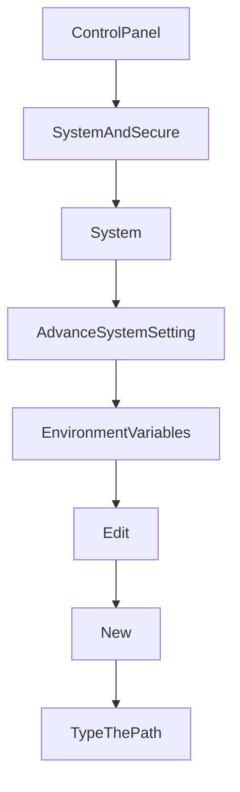

# To install PHP in Apache for Windows 2019
1. Visit [windows.php.net](https://windows.php.net/)
2. Download [php-7.2.22-Win32-VC15-x64.zip](https://windows.php.net/downloads/releases/archives/php-7.2.22-Win32-VC15-x64.zip)
3. Create a new folder in Drive C:, named `PHP7.2`
4. Upzip the __zip file__ and put all the extracted files in the folder `PHP7.2`
5. Set the __Environment Variable__ for the path `C:\PHP7.2`


6. Open cmd and type php-v and press Enter.
7. Open the file C:Apache24\conf\httpd
8. Add this code:
```
#PHP configuration
LoadModule php7_module "c:/php7.2/php7apache2_4.dll"
AddHandler application/x-httpd-php .php
AddType application/x-httpd-php .php .html
PHPIniDir "c:/php7"
```
9. Open the Service program, to stop and start Apache2.4.

## To install SSL Certificate
1. Add the SSL Cert files in the folder: C:Apache24/conf/ssl
2. Open the file C:/Apache24/conf/extra/httpd-ssl, and add these codes:
```
SSLCertificateFile "${SRVROOT}/conf/ssl/certificate.crt"
SSLCertificateKeyFile "${SRVROOT}/conf/ssl/private.key"
SSLCertificateChainFile "${SRVROOT}/conf/ssl/ca_bundle.crt"
```
3. Open the Service program, stop and then start Apache2.4
